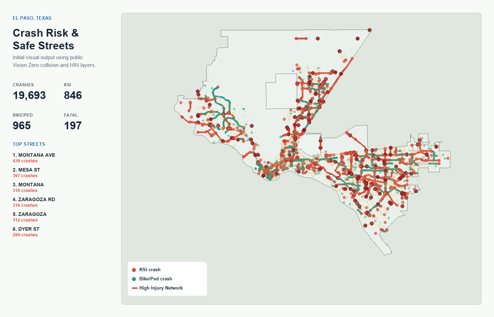

# El Paso Crash Risk & Safe Streets Analysis

GIS portfolio project analyzing El Paso crash risk, high-injury corridors, vulnerable road-user hotspots, and priority safe-streets investment areas using public crash, transportation, transit, school, bike, and equity-context data.

## Project Purpose

This project asks where El Paso's most serious roadway safety risks overlap with streets, intersections, schools, transit access, bicycle facilities, parks, and disadvantaged-community context.

The intended final product is an ArcGIS Pro analysis package and public-facing map narrative that identifies:

- Crash and KSI hot spots
- High-risk corridors and intersections
- Pedestrian and bicyclist crash concentrations
- Safety gaps near schools, bus stops, parks, and bike facilities
- Priority areas for safe-streets investment

## Study Area

Primary study area: City of El Paso, Texas.

Secondary context may include El Paso County and the El Paso MPO boundary where regional transportation layers are useful.

## Core Data Sources

- TxDOT Crash Records Information System (CRIS)
- City of El Paso Vision Zero materials and dashboard
- City of El Paso Open Data / ArcGIS Hub feature services
- El Paso Metropolitan Planning Organization GIS maps and shapefiles
- U.S. Census ACS demographic indicators, if equity analysis is included

See [docs/data-sources.md](docs/data-sources.md) for source links and layer notes.
See [docs/cris-request-checklist.md](docs/cris-request-checklist.md) for the recommended TxDOT CRIS crash-data request.
See [docs/arcgis-pro-workflow.md](docs/arcgis-pro-workflow.md) for the ArcGIS Pro import and analysis workflow.

## Planned Analysis

1. Acquire crash records for the selected time window from TxDOT CRIS.
2. Filter and classify crashes by severity, mode, year, and contributing factors.
3. Identify KSI crashes, pedestrian/bicyclist crashes, and high-injury locations.
4. Join crash patterns to roads, intersections, transit stops, schools, bike lanes, and parks.
5. Build corridor/intersection priority scores using crash severity and exposure context.
6. Compare findings with El Paso Vision Zero maps and published high-injury network material.
7. Produce final maps, summary charts, and a concise project narrative.

## Repository Structure

```text
.
├── data/                  # Data storage notes; raw data is not committed
├── docs/                  # Project plan, data sources, and methodology
├── scripts/               # Small validation and processing helpers
├── web/                   # Interactive browser-based project output
├── .gitignore
└── README.md
```

## Interactive Output

The first interactive project output is in [web/index.html](web/index.html). It uses public ArcGIS REST services at runtime to map collision density, KSI points, vulnerable-road-user crashes, High Injury Network segments, predictive safety network context, equity areas, schools, transit stops, and bike lanes.



Run it locally from the repository root:

```powershell
python -m http.server 5173
```

Then open:

```text
http://localhost:5173/web/
```

The local preview server for this workspace is currently running at that URL.

## Status

Initial project scaffold is complete. City of El Paso support layers have been downloaded locally into ignored `data/raw/` storage. TxDOT CRIS crash data is still pending.

Verified local City GIS layers are summarized in [data/source-inventory.csv](data/source-inventory.csv).

## Notes

Crash report details can contain restricted or sensitive information. This project should use public, aggregated, or appropriately redacted crash data and should avoid publishing personally identifying crash-record details.
